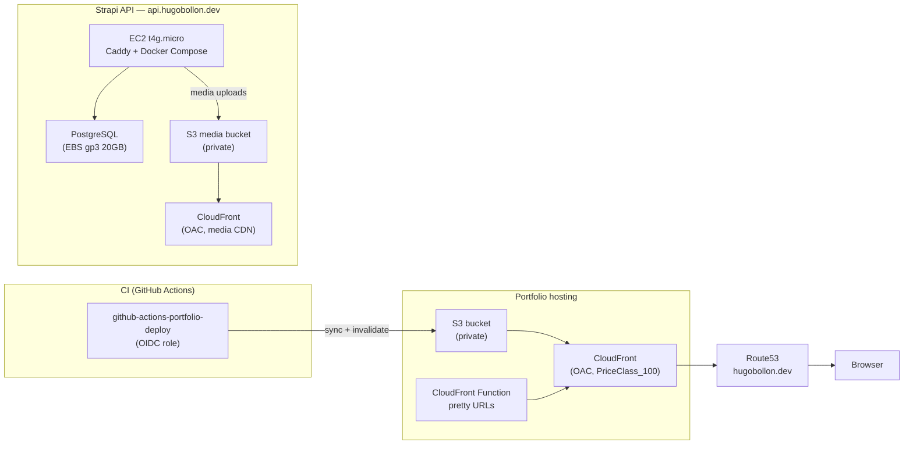

# portfolio-nuxt

My personal portfolio — a statically generated single-page site built with Nuxt 4. Space/cosmos dark theme, full EN/FR support, and a Strapi v5 CMS backend for content management.

Live at [hugobollon.dev](https://hugobollon.dev).

## Stack

- **Nuxt 4** — SSG via `nuxt generate`, deployed to S3 + CloudFront
- **Tailwind CSS v4** — design tokens, glassmorphism, custom animations
- **Strapi v5** — headless CMS, consumed at build time only
- **@nuxtjs/i18n** — EN (default) / FR with `/fr/` prefix
- **tsparticles** — particle background, adaptive to device capability
- **GitHub Actions** — CI/CD with AWS OIDC (no static credentials)

## Content management

### With Strapi (recommended)

Content is fetched from a Strapi v5 instance **at build time only** — there are no runtime API calls from the deployed site. Set `STRAPI_URL` and `STRAPI_TOKEN` in your environment, then run `yarn generate`.

The expected Strapi content types are documented in [`specs/strapi-data-model.md`](specs/strapi-data-model.md).

### Without Strapi (local fallback)

If `STRAPI_URL` or `STRAPI_TOKEN` are not set, the site builds with static fallback content defined in `locales/content/en.ts` and `locales/content/fr.ts`. This is useful for local development without a running Strapi instance, but the content is placeholder data — not production-ready.

## Prerequisites

- Node.js 24+
- Yarn Berry v4 (`corepack enable`)

## Getting started

```bash
cp .env.example .env.local
# fill in at minimum STRAPI_URL and STRAPI_TOKEN (or leave blank for fallback content)

yarn install
yarn dev        # development server on http://localhost:3000
yarn generate   # static site build → .output/public/
```

## Environment variables

Copy `.env.example` and fill in the relevant values.

| Variable                               | Required | Description                                                       |
| -------------------------------------- | -------- | ----------------------------------------------------------------- |
| `STRAPI_URL`                           | No\*     | Base URL of your Strapi instance                                  |
| `STRAPI_TOKEN`                         | No\*     | Strapi API token (read-only)                                      |
| `STRAPI_MEDIA_CDN_URL`                 | No       | CDN base URL to rewrite Strapi media URLs (e.g. CloudFront)       |
| `NUXT_PUBLIC_SITE_URL`                 | Yes      | Canonical site URL, used for sitemap and OG tags                  |
| `NUXT_PUBLIC_GITHUB_TOKEN`             | No       | GitHub PAT for project card stats (see warning below)             |
| `NUXT_PUBLIC_GOOGLE_SITE_VERIFICATION` | No       | Google Search Console verification meta tag value                 |
| `UMAMI_WEBSITE_ID`                     | No       | Umami Cloud website ID for analytics                              |
| `UMAMI_SCRIPT_URL`                     | No       | Umami script URL (defaults to `https://cloud.umami.is/script.js`) |
| `AWS_ROLE_ARN`                         | CI only  | IAM role ARN for OIDC-based S3/CloudFront deployment              |
| `AWS_REGION`                           | CI only  | AWS region                                                        |
| `S3_BUCKET_NAME`                       | CI only  | S3 bucket name                                                    |
| `CLOUDFRONT_DISTRIBUTION_ID`           | CI only  | CloudFront distribution ID for cache invalidation                 |

\*Without `STRAPI_URL` + `STRAPI_TOKEN`, the build falls back to local content.

> **Warning — `NUXT_PUBLIC_GITHUB_TOKEN` is exposed in the client bundle.**
> Any variable prefixed with `NUXT_PUBLIC_` is embedded in the generated JavaScript and visible to anyone who inspects the source. Use a fine-grained PAT scoped to **read-only public repositories** with no other permissions. Never use a token with write access or access to private repositories.

## Deployment

The site deploys automatically on push to `main` via GitHub Actions (see [`.github/workflows/deploy.yml`](.github/workflows/deploy.yml)). The workflow uses AWS OIDC authentication — no static AWS credentials are stored as secrets.

Required GitHub Actions secrets: `STRAPI_URL`, `STRAPI_TOKEN`, `STRAPI_MEDIA_CDN_URL`, `NUXT_PUBLIC_SITE_URL`, `NUXT_PUBLIC_GITHUB_TOKEN`, `NUXT_PUBLIC_GOOGLE_SITE_VERIFICATION`, `UMAMI_WEBSITE_ID`, `UMAMI_SCRIPT_URL`, `AWS_ROLE_ARN`, `AWS_REGION`, `S3_BUCKET_NAME`, `CLOUDFRONT_DISTRIBUTION_ID`.

## Infrastructure

The production infrastructure is managed with Terraform and hosted on AWS.



### Portfolio hosting

Static output from `yarn generate` is synced to a private S3 bucket and served through CloudFront with Origin Access Control (SigV4). A CloudFront Function rewrites clean URL paths to their `index.html` equivalents. Deployment uses an OIDC-authenticated IAM role — no static AWS credentials.

### Strapi API

Strapi v5 runs on an ARM EC2 instance (`t4g.micro`) behind a Caddy reverse proxy, containerized with Docker Compose. PostgreSQL data lives on a dedicated encrypted EBS volume with `prevent_destroy` and daily DLM snapshots (7-day retention). Media uploads go to a separate private S3 bucket served through a second CloudFront distribution.

The Strapi API is consumed **only at build time**. The deployed static site makes no runtime calls to the backend.

## License

MIT
